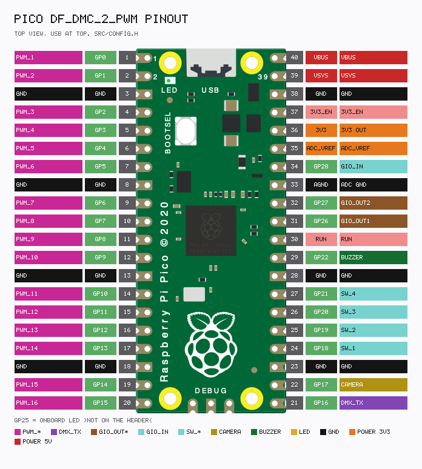

# DF_DMC_2_PWM pin map

[← Index](README.md)

Pins are fixed in `src/config.h`. Board: **Raspberry Pi Pico**.



Regenerate: `python tools/render_pinout.py` → [pinout.txt](pinout.txt) + `img/pinout.png`.

| Signal | GPIO | Electrical |
|--------|------|------------|
| PWM_1..16 | 0..15 | Servo or DMX PWM. See [dip.md](dip.md) |
| DMX_TX | 16 | DMX512 TX, PIO UART 250000 8N2 + BREAK/MAB |
| CAMERA | 17 | Open-collector, active low |
| SW_1..4 | 18..21 | Input, pull-up, ON = low |
| BUZZER | 22 | Push-pull, active high |
| LED | 25 | Onboard LED. Not on the header |
| GIO_OUT_1..2 | 26, 27 | Open-collector, active low |
| GIO_IN | 28 | Input, pull-up, low = bit 0 |

GP23 (SMPS) and GP24 (VBUS detect) are left to the Pico. GP25 is not a header pin.

---

## DMX512 — MAX485 + XLR3 + termination

GP16 is **TX only** (PIO UART). A MAX485 (or SN75176 / similar) turns TTL into RS-485. `DE` and `/RE` tied high = driver always on, receiver off.

XLR3 (DMX512): **pin 1** shield/GND, **pin 2** Data− (A), **pin 3** Data+ (B). Put **120 Ω** between A and B at the **last fixture**. If this board is a bus end, terminate there too.

```text
  Pico                                MAX485                 XLR3 (female, to fixtures)
  3.3V ------------------------------- VCC
  GND  ------------------------------- GND --------------- pin 1  shield / GND
  GP16 ------------------------------- DI
  3.3V ------------------------------- DE
  3.3V ------------------------------- /RE
                                       RO  (leave open)
                                       A  ---------------- pin 2  Data−
                                       B  ---------------- pin 3  Data+

  Last fixture (or this board if it is a bus end):
       A ---- 120 Ω ---- B
```

A/B polarity: if dimmers ignore the universe, swap A/B. The universe is still sent when every PWM pin is a motor. Only the PWM mirror is absent in that DIP mode.

---

## Camera GP17 — open-collector

Firmware drives GP17 as **open-collector + pull-up** (active low). The pad is **3.3 V only**. For a 5 V shutter input, use a 2N7000 level shift. Isolated dry-contact cables want an optocoupler instead.

```text
        3.3 V                         5 V
          |                            |
         BAT54*                       10k
          |                            |
  GP17 -- 330 Ω -- G (2N7000)         |
                    S -------- D ------+---- camera TTL in
                    |
                   GND

  Pico GND -------------------------------- camera GND
```

Idle (pad released): FET off → output high. Shutter (pad LOW): FET on → output 0 V.

---

## Buzzer GP22

Active high. Do not hang a 5 V buzzer on the GPIO. Use an NPN low-side switch.

```text
  5 V ---- buzzer+ ----+
                       |
                   collector
                      BC337 / BC547
                   emitter ---- GND
                      base
                       |
                      1 kΩ
                       |
                      GP22
```

Magnetic buzzers: 1N4148 across the buzzer, cathode toward 5 V. Active (self-drive) buzzers: omit the diode.

---

## GIO

GIO outs are the same open-collector style as the camera pin. GIO in is a pull-up; a closed switch to GND sets bit 0 and the board sends `MSG_GIO_IN` after Connect.
